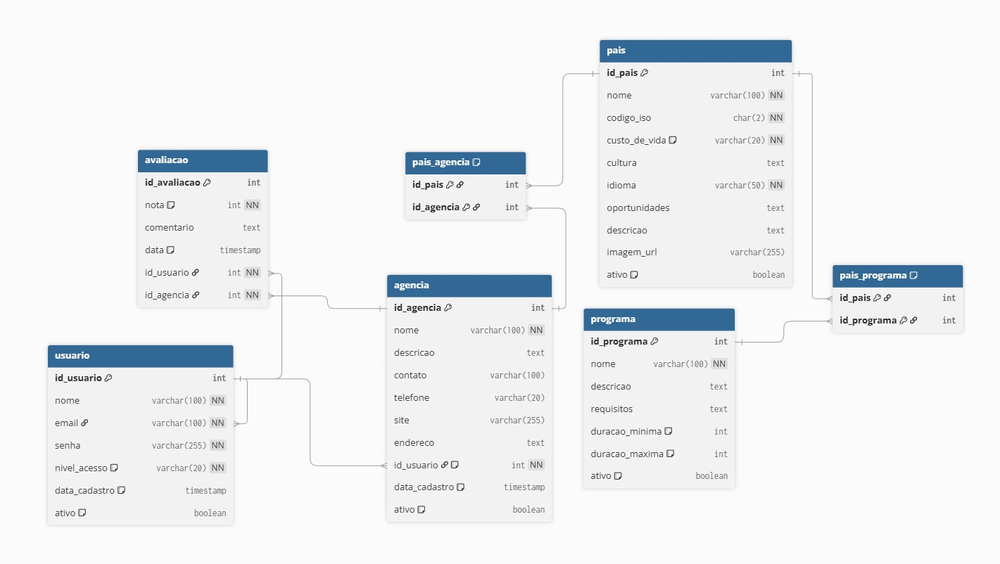

# Projeto Integrador - Modelo
GlobalBridge

*(A nossa plataforma tem como objetivo facilitar o processo de intercâmbio internacional, reunindo em um único portal informações essenciais para estudantes interessados em estudar no exterior. O site apresenta requisitos para ingressar no país, aspectos culturais e convivência com a comunidade local, estimativas de custo de vida e indicações de agências especializadas que auxiliam na concretização da experiência internacional. A proposta é oferecer orientação clara, confiável e acessível, promovendo maior segurança e planejamento aos futuros intercambistas.)*

Professor: [Marco André Mendes](github.com/marcoandre)

Equipe:
- [Athur Candido](https://github.com/ArthurBenk)
- [Caue Kreutz](https://github.com/CaueKreutz)
- [Filipe Bento](https://github.com/FilipeBento19)
- [Ijair Machado](https://github.com/youtario)

Links do projeto:
-   [Documentação (esse documento)](github.com/marcoandre/pi-modelo)
-   Backend: [Repositório](github.com/marcoandre/pi-backend) e [Publicação](https://pi-backend.herokuapp.com/)
-   Frontend: [Repositório](https://github.com/FilipeBento19/globalbridge-frontend) e [Publicação](https://globalbridge-frontend.vercel.app/)

---

# 1. Desenvolvimento

## 1.1 Modelo de Sistema

### Plataforma de intermediação para intercâmbios

O sistema escolhido para o desenvolvimento do projeto é uma **plataforma digital de apoio ao planejamento de intercâmbios internacionais**, chamada **GlobalBridge**. O objetivo da plataforma é facilitar o acesso de estudantes e interessados em experiências internacionais a informações confiáveis sobre países, programas de intercâmbio e agências especializadas.

A escolha desse sistema foi feita porque muitas pessoas têm interesse em estudar ou trabalhar no exterior, mas encontram dificuldades para comparar destinos, entender os custos envolvidos e encontrar agências confiáveis para iniciar o processo. Atualmente, grande parte dessas informações está espalhada em diferentes sites ou depende de contato direto com agências, o que pode tornar o processo confuso para quem está começando a planejar o intercâmbio.

Dessa forma, a plataforma GlobalBridge busca reunir essas informações em um único ambiente digital, permitindo que o usuário explore diferentes países, conheça características culturais, custos de vida, oportunidades de estudo e trabalho, além de ter acesso a agências que podem auxiliar na realização do intercâmbio.

---

# 2. Situação Problema

## Introdução

O intercâmbio internacional tem se tornado cada vez mais comum entre estudantes e jovens profissionais que buscam novas oportunidades de aprendizado, experiência cultural e desenvolvimento pessoal. Programas como **Study & Work**, **Au Pair** e cursos de idioma no exterior são algumas das opções mais procuradas por quem deseja viver uma experiência internacional.

Entretanto, apesar do grande interesse nesse tipo de experiência, muitas pessoas encontram dificuldades durante o processo inicial de planejamento do intercâmbio. Isso acontece principalmente pela falta de informações centralizadas e pela dificuldade de comparar diferentes destinos e programas disponíveis.

## Situação-problema

Atualmente, quem deseja realizar um intercâmbio costuma iniciar sua pesquisa na internet, buscando informações sobre países, custos e tipos de programas disponíveis. No entanto, essas informações geralmente estão distribuídas em diversos sites diferentes, como páginas de agências, blogs, vídeos e redes sociais.

Esse processo pode acabar gerando confusão para o usuário, já que nem sempre é fácil identificar quais informações são confiáveis ou atualizadas. Além disso, muitas vezes o usuário precisa visitar vários sites diferentes para entender aspectos importantes do destino escolhido, como custo de vida, idioma, cultura local ou oportunidades de trabalho durante o intercâmbio.

Outro fator que dificulta o planejamento é a escolha da agência responsável pelo intercâmbio. Existem muitas agências no mercado, e para quem está iniciando a pesquisa pode ser difícil identificar quais são mais confiáveis ou qual oferece o programa mais adequado ao perfil do estudante.

Também é comum que o usuário tenha dúvidas sobre qual país escolher, já que diferentes destinos possuem características distintas, como custo de vida, clima, cultura, oportunidades de trabalho e facilidade de obtenção de visto.

## Conclusão

Diante dessa situação, percebe-se a necessidade de uma plataforma que reúna informações importantes sobre intercâmbios de forma organizada e acessível. Um sistema como o **GlobalBridge** pode ajudar os usuários a explorar diferentes destinos, comparar características dos países e encontrar agências que ofereçam programas compatíveis com seus objetivos.

Com uma ferramenta centralizada e interativa, o processo de planejamento do intercâmbio se torna mais simples, permitindo que o usuário tome decisões mais informadas e seguras antes de iniciar sua experiência internacional.

---

# 3. Descrição da proposta

A proposta do projeto é desenvolver a plataforma **GlobalBridge**, um sistema online que reúne informações relevantes sobre intercâmbios internacionais e conecta usuários interessados a agências especializadas nesse tipo de programa.

O foco principal do software será **facilitar a busca e comparação de destinos de intercâmbio**, apresentando informações como custo de vida, cultura local, idioma predominante, oportunidades de estudo e trabalho e outras características importantes para quem deseja morar temporariamente em outro país.

Entre as principais funcionalidades do sistema estarão a exploração interativa de países, filtros de pesquisa por aspectos como cultura, idioma, ensino e oportunidades de trabalho, além da apresentação de programas de intercâmbio como **Study & Work**, **Au Pair** e outros formatos disponíveis.

Com essas funcionalidades, o GlobalBridge pretende tornar o processo de planejamento de um intercâmbio mais claro, organizado e acessível para qualquer pessoa interessada em viver uma experiência internacional.

# 4. Modelagem de Dados

**Descrição das Tabelas**

**usuario:** Armazena os dados dos usuários do sistema, incluindo administradores, usuários comuns e representantes de agências. Também controla o nível de acesso e status da conta.

**agencia**: Responsável por armazenar as informações das agências de intercâmbio cadastradas na plataforma, como dados de contato e descrição. Cada agência está vinculada a um usuário responsável.

**pais**: Contém os dados dos países disponíveis para intercâmbio, incluindo informações como custo de vida, cultura, idioma e oportunidades, além de uma descrição geral do destino.

**programa**: Armazena os tipos de programas de intercâmbio oferecidos, como Study & Work e Au Pair, incluindo suas descrições, requisitos e duração.

**avaliacao**: Registra as avaliações feitas pelos usuários sobre as agências, incluindo nota e comentário, permitindo feedback sobre os serviços oferecidos.

**pais_agencia**: Tabela intermediária que relaciona as agências com os países onde atuam, permitindo que uma agência esteja presente em vários países e vice-versa.

**pais_programa**: Tabela intermediária responsável por relacionar os programas de intercâmbio com os países onde estão disponíveis.

# 4. Regras de negócio
**RN001** – Cadastro de País

Um país só pode ser cadastrado se possuir informações básicas como nome, custo de vida, idioma e descrição.

**RN002** – Atualização de País

Apenas usuários com nível de administrador podem editar informações de países.

**RN003** – Cadastro de Programa

Um programa de intercâmbio deve possuir nome, descrição e requisitos mínimos para ser cadastrado no sistema.

**RN004** – Associação entre Programa e País

Um programa só pode ser vinculado a um país se for realmente oferecido nesse destino.

**RN005** – Cadastro de Agência

Uma agência só pode ser cadastrada se possuir informações válidas de contato ou site oficial.

**RN006** – Associação entre Agência e País

Uma agência só pode ser associada a países nos quais realmente atua.

**RN007** – Exibição de Países

O sistema deve exibir apenas países que possuam informações completas cadastradas.

**RN008** – Aplicação de Filtros

Os filtros devem considerar apenas dados existentes no sistema.

**RN009** – Acesso Administrativo

Somente usuários autenticados como administradores podem realizar alterações no sistema.

**RN010** – Integridade dos Dados

Não é permitido excluir um país que esteja vinculado a programas ou agências sem remover os vínculos previamente.

# 5. Requisitos funcionais

### **Níveis de acesso:**

* **Visitante** – Usuário que acessa o sistema sem estar autenticado.
* **Usuário** – Usuário autenticado que navega pela plataforma e pode avaliar agências.
* **Empresa** – Usuário autenticado responsável por uma agência.
* **Administrador** – Usuário com controle total do sistema.

### **Entradas:**

### **RF001 - Cadastro de Usuário**

O sistema deve permitir que o visitante crie uma conta para acessar funcionalidades como avaliações.

**Dados de entrada:** nome, email, senha
**Usuários:** visitante

### **RF002 - Autenticação de Usuário**

O sistema deve permitir que usuários realizem login para acessar suas funcionalidades.

**Dados de entrada:** email, senha
**Usuários:** visitante

### **RF003 - Cadastro de Agência**

O sistema deve permitir que usuários do tipo empresa cadastrem sua agência na plataforma.

**Dados de entrada:** nome, descrição, contato, telefone, site, endereço
**Usuários:** empresa

### **RF004 - Cadastro de País**

O sistema deve permitir que o administrador cadastre países com suas informações.

**Dados de entrada:** nome, código_iso, custo_de_vida, cultura, idioma, oportunidades, descrição
**Usuários:** administrador

### **RF005 - Cadastro de Programa**

O sistema deve permitir cadastrar programas de intercâmbio.

**Dados de entrada:** nome, descrição, requisitos, duração mínima, duração máxima
**Usuários:** administrador

### **RF006 - Avaliação de Agência**

O sistema deve permitir que usuários avaliem agências com nota e comentário.

**Dados de entrada:** nota, comentário
**Usuários:** usuário

### **RF007 - Edição de Agência**

O sistema deve permitir que empresas editem os dados da sua própria agência.

**Dados de entrada:** nome, descrição, contato, telefone, site, endereço
**Usuários:** empresa

### **Processos:**

### **RF008 - Filtragem de Países**

O sistema deve permitir filtrar países com base em critérios como cultura, idioma e oportunidades.

**Dados de entrada:** filtros selecionados
**Usuários:** visitante, usuário

### **RF009 - Associação de Programa ao País**

O sistema deve permitir vincular programas aos países disponíveis.

**Dados de entrada:** id_pais, id_programa
**Usuários:** administrador

### **RF010 - Associação de Agência ao País**

O sistema deve permitir vincular agências aos países onde atuam.

**Dados de entrada:** id_agencia, id_pais
**Usuários:** administrador, empresa

### **RF011 - Gerenciamento de Avaliações**

O sistema deve permitir que usuários editem ou removam suas avaliações.

**Dados de entrada:** id_avaliacao, nota, comentário
**Usuários:** usuário

### **RF012 - Controle de Acesso**

O sistema deve controlar o acesso às funcionalidades com base no nível do usuário.

**Dados de entrada:** nível_acesso
**Usuários:** sistema

### **Saídas:**

### **RF013 - Listagem de Países**

O sistema deve exibir os países disponíveis na plataforma.

**Dados de saída:** nome, resumo, imagem
**Usuários:** visitante, usuário

### **RF014 - Detalhamento de País**

O sistema deve exibir informações completas de um país.

**Dados de saída:** custo de vida, cultura, idioma, oportunidades, programas
**Usuários:** visitante, usuário

### **RF015 - Listagem de Agências por País**

O sistema deve exibir agências disponíveis em um país.

**Dados de saída:** nome, descrição, contato
**Usuários:** visitante, usuário

### **RF016 - Exibição de Avaliações**

O sistema deve mostrar avaliações de uma agência.

**Dados de saída:** nota, comentário, nome do usuário
**Usuários:** visitante, usuário

# 6. Requisitos não funcionais

Requisitos não funcionais (**RNFs**) são as restrições impostas a um sistema que definem seus atributos de qualidade.

Eles geralmente são indicados por adjetivos como **segurança**, **desempenho** e **escalabilidade**.

**6.1 Categorias de requisitos não funcionais**

Os requisitos não funcionais são importantes porque ajudam a garantir que o sistema atenda às necessidades do usuário.

Os Requisitos Não Funcionais explicam as limitações e restrições do sistema a ser projetado. **Esses requisitos não têm nenhum
impacto na funcionalidade do aplicativo.** Além disso, existe uma prática comum de subclassificar os requisitos não funcionais em várias categorias:

- Interface de Usuário
- Confiabilidade
- Segurança
- Atuação
- Manutenção

Os requisitos não funcionais podem ser divididos em duas categorias:

1. **Atributos de qualidade:** Estas são as características do sistema que determinam sua qualidade geral. Exemplos de atributos de qualidade incluem segurança, desempenho e usabilidade.
2. **Restrições:** Estas são as limitações impostas ao sistema.
Exemplos de restrições incluem tempo, recursos e ambiente.

**6.2 Vantagens dos requisitos não funcionais**

Os requisitos não funcionais ajudam a garantir que o sistema seja:

1. Adaptado às necessidades do usuário.
2. Adequado à finalidade.
3. Escalável, seguro e confiável.
4. Fácil de usar e manter.

**6.3 Exemplos de requisitos não funcionais**

Aqui estão alguns exemplos de requisitos não funcionais:
1. **Segurança**: O sistema deve ser protegido contra acesso não
autorizado.
2. **Atuação**: O sistema deve ser capaz de lidar com o número necessário
de usuários sem qualquer degradação no desempenho.
3. **Escalabilidade**: O sistema deve ser capaz de aumentar ou diminuir
conforme necessário.
4. **Disponibilidade**: O sistema deve estar disponível quando necessário.
5. **Manutenção**: O sistema deve ser fácil de manter e atualizar.
6. **Portabilidade**: O sistema deve ser capaz de rodar em diferentes
plataformas com alterações mínimas.
7. **Confiabilidade**: O sistema deve ser confiável e atender aos requisitos
do usuário.
8. **Usabilidade**: O sistema deve ser fácil de usar e entender.
9. **Compatibilidade**: O sistema deve ser compatível com outros sistemas.
10. **Conformidade**: O sistema deve cumprir todas as leis e regulamentos
aplicáveis.

**6.4 Exemplo de organização dos requisitos não funcionais**

(_A seguir, um exemplo de organização de requisitos não funcionais._)

**Requisitos não funcionais:**

- **R.N.F. 01 - Nome do requisito não funcional:** descrição do requisito.
- **R.N.F. 02 - Nome do requisito não funcional:** descrição do requisito.

**Exemplos de requisitos não funcionais:**

**Sistema de Padaria**:
- **R.N.F. 01 - Navegador homologado:** O sistema deverá ser homologado para os navegadores Google Chrome e Mozilla Firefox.
- **R.N.F. 02 - Processador:** É recomendado para o sistema  no mínimo um processador Intel i3, similar ou superior a geração 7100 ou AMD Ryzen 3 da geração similar ou superior ao 3100, para que o servidor funcione em sua melhor performance.
- **R.N.F. 03 - Memória RAM:** é recomendável que o sistema possua no mínimo 2GB de RAM para melhor performance.
- **R.N.F. 04 - Arquitetura:** Será utilizada a arquitetiura MVC para o desenvolvimento do sistema, com uso de uma API REST para comunicação com o banco de dados.
- **R.N.F. 05 - Banco de dados:** O sistema será implementado com o banco de dados MySQL.
- **R.N.F. 06 - Conexão com banco de dados:** Para conexão com o banco de dados, o sistema utilizará a ferramenta de MySQL Connector.
- **R.N.F. 07 - Implementação:** O sistema deverá ser desenvolvido com linguagem Python, Javascript, HTML5, CSS3 e SQL.
- **R.N.F. 08 - Segurança:** Ficará a critério do responsável do estabelecimento a segurança dos acessos ao sistema, tendo consciência das pessoas que possua permissão para acesso.
- **R.N.F. 09 - Ambiente de Desenvolvimento Integrado (IDE):** Para criação do sistema, será utilizado o editor de texto Visual Studio Code.
- **R.N.F. 10 - Disponibilidade:** O sistema irá atender 99% do tempo de uso, somente ocorreria problemas de cadastro, remoção, inserção ou alteração em casos de falta de rede ou energia.
- **R.N.F. 11 - Legais:** O sistema deve atender às exigências da LGPD (Leis Gerais da Proteção de Dados).

**Sistema de Ordem de Serviço:**
- **R.N.F. 01 - Navegadores homologados:** o sistema deverá ser homologado para os navegadores Google Chrome e Mozilla Firefox.
- **R.N.F. 02 - Tecnologia Front-end:** Para a exibição em front-end, o software utilizará o CSS3 e o HTML5, além do framework Vue.js.
- **R.N.F. 03- Tecnologia Back-end:** O software será desenvolvido pela linguagem de programação Python, com o framework Django e a API REST com Django REST Framework.
- **R.N.F. 04 - Interoperabilidade:** O banco de dados será o MySQL, com a linguagem SQL de banco, sendo todo produzido através do MySQL Workbench .
- **R.N.F. 05 - Forma de uso do software:** O sistema por fazer parte de um ambiente interno, provavelmente será utilizado de acordo com as horas de trabalho da empresa, mas estará ativo 24 horas por dia em 7 dias por semana.
- **R.N.F. 06 - Desempenho:** Para a utilização correta e com uma qualidade e eficiência melhor, é recomendado que se use o SO mais atualizado, com recursos de hardware equivalentes a um processador intel i3 5°Gen ou semelhante, e 8GB de memória RAM, assim como os navegadores homologados.
- **R.N.F. 07- Autenticação:** Para realizar o acesso ao sistema é necessário ter um usuário de autenticação criado pelo administrador, além da possibilidade de solicitar um envio de redefinição de senha.
- **R.N.F. 08 - Web Server:** O servidor web utilizado será o Apache Tomcat, nas versões mais atualizadas.
- **R.N.F. 09 - Níveis de segurança:** O software terá diferentes tipos de acesso para cada tipo de login, tendo as permissões ideais a função de cada um.

**6.6 Conclusão**

Requisitos não funcionais são essenciais para qualquer sistema. Eles ajudam a garantir que o sistema atenda às necessidades do usuário e seja capaz de funcionar como pretendido.

É importante considerar cuidadosamente todos os requisitos não funcionais antes de projetar e desenvolver um sistema.
Eles ajudam a garantir que o sistema atenda às necessidades do usuário e seja capaz de funcionar como pretendido.

# 7. Diagrama de Caso de Uso

**7.1 Introdução**

O diagrama de caso de uso é uma ferramenta de modelagem que descreve o comportamento de um sistema a partir da perspectiva do usuário. Ele é usado para capturar os requisitos funcionais de um sistema.

- Especificam a visão externa do sistema.
- Descrevem como o sistema é percebido por seus usuários.
- Descrevem as interações entre os usuários e o sistema.

**Os casos de uso:**
- Descrevem como os **usuários interagem com o sistema** (as funcionalidades do sistema)
- Facilitam a **organização dos requisitos** de um sistema.
- Dão uma **visão externa** do sistema
- O conjunto de casos de uso deve ser capaz de comunicar a **funcionalidade** e o **comportamento** do sistema para o cliente.
- Descrevem **o que** o sistema faz, mas **não** especificam **como** isso deve ser feito.

**7.2 Elementos do diagrama de caso de uso**

7.2.1 **Atores**

- Representam os papéis desempenhados por **elementos externos** ao sistema
  - Ex: humano (usuário), dispositivo de hardware ou outro sistema (cliente)
- Elementos que **interagem** com o sistema

Notação:

**Exemplo: Loja de CDs**

**Identificando os atores**
- Uma loja de CDs possui discos para venda. Um cliente pode comprar uma quantidade ilimitada de discos para isto ele deve se dirigir à loja.
- A loja possui um **atendente** cuja função é atender os clientes durante a venda dos discos. A loja também possui um **gerente** cuja função é administrar o estoque para que não faltem discos. Além disso é ele quem dá folga ao atendente, ou seja, ele também atende os clientes durante a venda dos discos.

**E o cliente?**
- Não é ator pois ele **não interage** com o sistema!

**7.2.2 Casos de uso**

- Representam **funcionalidades** do sistema (requisitos funcionais).
- São iniciados por **atores** ou por outros casos de uso.

> **Dica**: nomeie os casos de uso com **verbos** no **infinitivo**.

Notação:

**Exemplo: Loja de CDs**

**Identificando os casos de uso**

- Uma loja de CDs possui discos para venda. Um cliente pode comprar uma quantidade ilimitada de discos para isto ele deve se dirigir à loja. A loja possui um atendente cuja função é atender os clientes durante a **venda dos discos**.
- A loja também possui um gerente cuja função é **administrar o estoque** para que não faltem discos. Além disso é ele quem dá folga ao atendente, ou seja, ele também atende os clientes durante a **venda dos discos**.

**7.2.3 Relacionamentos**

**7.2.3.1 Relacionamento de associação**

- Indica que um ator **participa** de um caso de uso, ou seja, o ator **interage** (comunica-se) com o caso de uso.
- É representado por uma **linha sólida**.
- Um ator pode se relacionar com **um ou mais casos de uso**.

> Dicas:
> - Não use setas nas linhas de associação.
> - Associações não representam fluxo de informação.

**Exemplo: Loja de CDs**

**Identificando os relacionamentos de associação**

- Uma loja de CDs possui discos para venda. Um cliente pode comprar uma quantidade ilimitada de discos para isto ele deve se dirigir à loja. A loja possui um _atendente_ cuja função é atender os clientes durante a **venda dos discos**.
- A loja também possui um _gerente_ cuja função é **administrar o estoque** para que não faltem discos. Além disso é ele quem dá folga ao _atendente_, ou seja, ele também atende os clientes durante a **venda dos discos**.

**7.2.3.2 Relacionamento de generalização/especialização**

**Generalização de atores**

- Quando dois ou mais atores podem se **comunicar com o mesmo conjunto de casos de uso**.
- Indica que um ator **herda** as características de outro ator.
– Um filho (herdeiro) pode se comunicar com todos os casos de uso que seu pai se comunica.

> **Dica:** coloque os herdeiros **embaixo**.

**Notação:**

**Exemplo: Loja de CDs**

**Identificando os relacionamentos de generalização/especialização de atores**

**Generalização de casos de uso**

– O caso de uso filho herda o comportamento e o significado do caso de uso pai.
– O caso de uso filho pode incluir ou sobrescrever o comportamento do caso de uso pai.
– O caso de uso filho pode substituir o caso de uso pai em qualquer lugar que ele apareça.

> **Dica:** deve ser aplicada quando uma condição resulta na definição de
diversos fluxos alternativos.

Notação:

**Exemplo: Loja de CDs**

**Identificando os relacionamentos de generalização/especialização de casos de uso**

**Novos requisitos:**

- As vendas podem ser **à vista** ou **a prazo**. Em ambos os casos o estoque é
atualizado e uma nota fiscal, entregue ao consumidor.
- No caso de uma **venda à vista**, clientes cadastrados na loja e que compram mais de 5 CDs de uma só vez ganham um desconto de 1% para cada ano de cadastro.
- No caso de uma **venda a prazo**, ela pode ser parcelada em 2 pagamentos com um
acréscimo de 20%. As vendas a prazo podem ser pagas no **cartão** ou no **boleto**.
  - Para pagamento com **boleto**, são gerados boletos bancários que são entregues ao cliente e armazenados no sistema para lançamento posterior no caixa.
  - Para pagamento com **cartão**, os clientes com mais de 10 anos de cadastro na loja ganham o mesmo desconto das compras à vista.

**Identificando mais relacionamentos de generalização/especialização de casos de uso**

**7.2.3.3 Relacionamento de dependência**

**Extensão**

- Representa uma variação/extensão do comportamento do caso de uso base.
- O caso de uso estendido só é executado sob certas circunstâncias.
- Separa partes obrigatórias de partes opcionais.
  - Partes obrigatórias: caso de uso base.
  - Partes opcionais: caso de uso estendido.
- Fatorar comportamentos variantes do sistema (podendo reusar este comportamento
em outros casos de uso).

**Notação:**

 - notação")

**Exemplo: Loja de CDs**

**Identificando os relacionamentos de dependência (extensão)**

**Novos requisitos:**
- No caso de uma venda à vista, clientes cadastrados na loja e que compram mais
de 5 CDs de uma só vez ganham um **desconto** de 1% para cada ano de cadastro.
- No caso de uma venda a prazo...
  - ...Para pagamento com cartão, os clientes com mais de 10 anos de cadastro na loja ganham o mesmo **desconto** das compras à vista.

")

**Inclusão**

- Evita repetição ao fatorar uma atividade
comum a dois ou mais casos de uso.
- Um caso de uso pode incluir vários casos de uso.

**Notação:**

 - notação")

**Exemplo: Loja de CDs**

**Novos requisitos:**
Para efetuar vendas ou administrar estoque, atendentes e gerentes terão que **validar** suas respectivas senhas de
acesso ao sistema.

")

**7.2.4 Fronteira do sistema**

- Elemento opcional (mas essencial para um bom
entendimento).
- Serve para definir a área de atuação do sistema, ou seja, seus limites.

**Identificando a fronteira do sistema**

---

